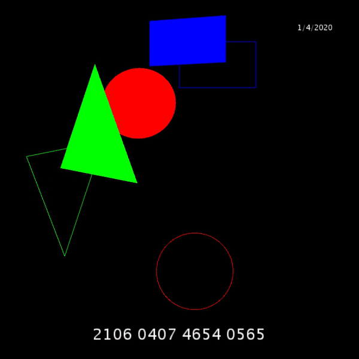

# status_game

## info

This [Processing](https://processing.org/) sketch creates a <1 second video which contains airtime recharge digits.

It contains moving shapes and the digits will only be shown when the shapes have aligned with their outline.

The video can be posted to platforms such as whatsapp status to challenge your viewers.

Since the video is fast moving the viewer has to stop the video at right time to view the digits
The viewer has to recharge using the digits before any other viewer to get the airtime.

This sketch requires [VideoExport library](https://github.com/hamoid/video_export_processing) and the library requires FFMPEG to be installed on your system.

Change the `String credit` to match your airtime recharge digits and `boolean exp` to `true` to export your video

## video

Output video looks like this

